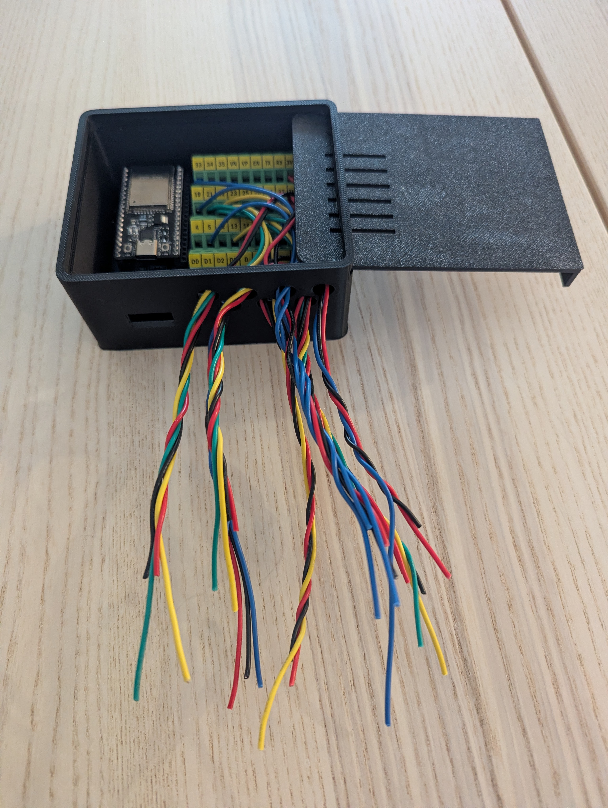

# Enclosure for HCDC Breakout Board
- USB-C recessed access
- Seven ports
- Backpanel access to screw adaptors for last row adjustments
- Sliding lid
- gcode for Elegoo Centauri Carbon

## Commands
- help / h    Show this menu
- start / s     Start logging
- stop  / x     Stop logging
- press / p     Open valve (spray)
- release / r   Close valve
- pulse         1-second spray
- pulse 500     Custom pulse (ms)
- tare / t      Zero the scale
- read          Single sensor reading
- servo         Test servo movement
- setpress 45   Test servo angle
- status        Show storage status
- files / ls    List saved files
- dump          Output RAM buffer
- download      Output SPIFFS lofg

## Example Output

=== SENSOR READING ===
- Mass:        -74.92 g
- Nozzle temp: 67.6 F
- Surface temp:67.8 F
- Ambient temp:67.7 F
- Humidity:    35.3 %
- Pressure:    935.0 hPa
- Accel:       1.054
- Mic RMS:     713
